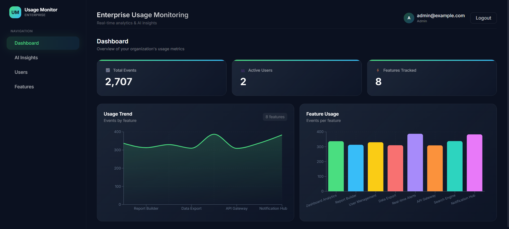
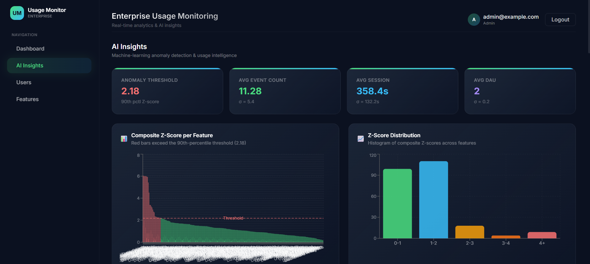
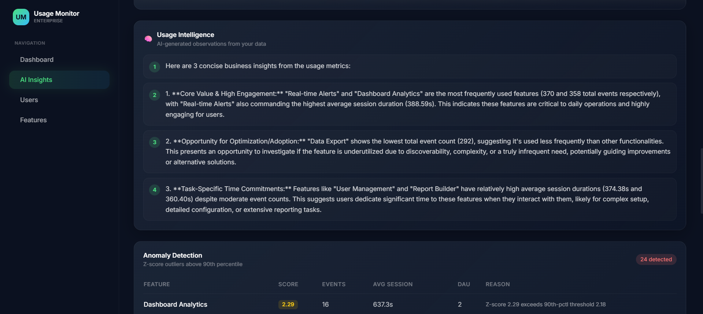
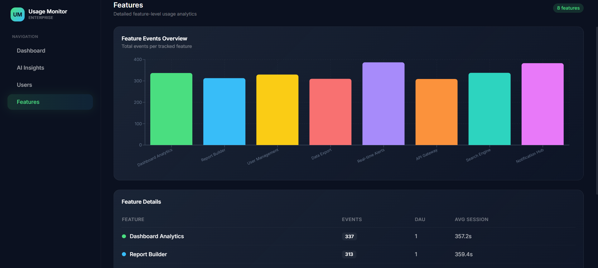

# Enterprise Usage Monitoring & Admin Platform — README

## 1. Overall System Design

```
 ┌──────────────────────────────────────────────────────────────────────┐
 │                      FRONTEND  (React 18 + Vite 5)                  │
 │                                                                      │
 │  Login.jsx ──► authService.login() ──► POST /auth/login             │
 │                                                                      │
 │  Dashboard.jsx ─┬─► analyticsService.getUsageSummary()              │
 │                 └─► analyticsService.getFeatureUsage()               │
 │                                                                      │
 │  AIInsights.jsx ─┬─► aiService.getInsights()                        │
 │                  ├─► aiService.getAnomalies()                       │
 │                  └─► aiService.getChartData()                       │
 │                                                                      │
 │  Users.jsx / Features.jsx  (placeholder — future wire-up)           │
 │                                                                      │
 │  Axios apiClient.js ── Bearer token interceptor ── 401 → /login    │
 └────────────────────────────┬─────────────────────────────────────────┘
                              │ REST / JSON over HTTP
                              ▼
 ┌──────────────────────────────────────────────────────────────────────┐
 │                     BACKEND  (FastAPI + Python)                      │
 │                                                                      │
 │  main.py ── FastAPI() ── CORS("*") ── @app.on_event("startup")     │
 │       ├── auth_routes    /auth/*      (register, login, me)         │
 │       ├── usage_routes   /events/*    (track)                       │
 │       ├── analytics_routes /analytics/* (summary, feature, user,    │
 │       │                                  aggregate/run)             │
 │       └── ai_routes      /ai/*        (anomalies, usage-insights)  │
 │                                                                      │
 │  SERVICE LAYER                                                       │
 │   auth_service.py       ── SHA-256 + pepper hashing, user CRUD      │
 │   usage_service.py      ── validates feature→org, creates UsageLog  │
 │   aggregation_service.py── daily bucket rollup into AggregatedUsage │
 │   analytics_service.py  ── SQL aggregations (func.count, func.avg)  │
 │   ai_service.py         ── Dask z-score anomalies + Gemini LLM     │
 │                                                                      │
 │  jwt_utils.py ── PyJWT HS256 encode / decode                        │
 │  config.py    ── pydantic-settings BaseSettings (.env)              │
 │  session.py   ── SQLModel engine + init_db + get_session            │
 └────────────────────────────┬─────────────────────────────────────────┘
                              │ SQLModel ORM
                              ▼
 ┌──────────────────────────────────────────────────────────────────────┐
 │                       DATABASE  (SQLite / Postgres)                  │
 │                                                                      │
 │  Organization ──1:N──► User                                          │
 │  Organization ──1:N──► Feature                                       │
 │  Feature      ──1:N──► UsageLog  (raw telemetry events)             │
 │  (Organization, Feature, date) ──► AggregatedUsage (daily rollup)   │
 └──────────────────────────────────────────────────────────────────────┘
                              ▲
                              │ seed_data.py
 ┌──────────────────────────────────────────────────────────────────────┐
 │  HUGGING FACE  DukeNLPGroup/movielens-100k                          │
 │  user_id → User,  item_id → Feature,  rating → session_duration    │
 │  2 % anomaly injection  (session × 3)                               │
 └──────────────────────────────────────────────────────────────────────┘
```

### How the Layers Connect (code-level)

1. **Startup** — `main.py` creates a `FastAPI()` instance, adds `CORSMiddleware` with `allow_origins=["*"]`, registers four `APIRouter` objects (`auth_routes.router`, `usage_routes.router`, `analytics_routes.router`, `ai_routes.router`), and calls `init_db()` from `session.py` which runs `SQLModel.metadata.create_all(engine)` to bootstrap all five tables.

2. **Authentication flow** — `auth_routes.py` exposes three endpoints.  
   - `POST /auth/register` calls `auth_service.create_user()` which hashes the password with `hashlib.sha256(password + "usage-monitor-pepper")`, validates the organization, and returns `UserRead`.  
   - `POST /auth/login` accepts `OAuth2PasswordRequestForm`, calls `auth_service.authenticate()` to verify the hash, and issues a JWT via `jwt_utils.create_access_token(subject=user.id, org_id, role)`.  
   - `GET /auth/me` calls `auth_service.get_current_user()` — an `OAuth2PasswordBearer` dependency that decodes the token with `jwt_utils.decode_token()` and returns `UserRead`.

3. **Event tracking** — `POST /events/track` receives a `UsageEventCreate` body (`org_id`, `feature_id`, `event_type`, `session_duration`, `metadata`). `usage_service.track_event()` first verifies the feature belongs to the org (`select(Feature).where(Feature.id == … , Feature.organization_id == …)`), then creates a `UsageLog` row with the authenticated user's id and commits it.

4. **Aggregation** — `POST /analytics/aggregate/run` checks `current_user.role`; non-admins get a friendly message, admins trigger `aggregation_service.aggregate_daily(date)` which rolls up `UsageLog` rows by `(organization_id, feature_id)` and upserts `AggregatedUsage`, returning the count aggregated.

5. **Analytics queries** — `analytics_service.py` provides three functions:  
   - `get_usage_summary(org_id)` → `SELECT count(*) FROM usage_log WHERE org_id = ?`, `SELECT count(DISTINCT user_id)`, `SELECT count(DISTINCT feature_id)`.  
   - `get_feature_usage(org_id)` → reads `AggregatedUsage` rows, groups by `feature_id`, sums `event_count`, `daily_active_users`, averages `avg_session_duration`.  
   - `get_user_activity(org_id, days)` → reads raw `UsageLog` for last N days, groups by `user_id`, counts events and averages session duration.

6. **AI engine** — `ai_service.py` implements three capabilities with in-memory caching (TTL 120s):  
   - **Anomaly detection** (`detect_anomalies(org_id)`) — loads aggregated rows, computes per-feature z-scores over `[event_count, avg_session_duration, daily_active_users]`, derives an L2 norm, flags anything ≥ 90th percentile, and returns `AnomalyResponse` with feature names + details.  
   - **Insight generation** (`generate_insights(org_id)`) — takes top-3 features by events, builds a prompt, and calls **Gemini 2.5 Flash** when `GEMINI_API_KEY` is present; otherwise emits heuristic bullets.  
   - **Chart data** (`get_chart_data(org_id)`) — returns z-score breakdowns, histogram buckets, raw metrics, and the anomaly threshold for the charts.

7. **Frontend rendering** — the React SPA at `frontend/src/App.jsx` wraps all routes in `<AuthProvider>` (from `useAuth.jsx`) and `<BrowserRouter>`. A `<RequireAuth>` component checks `useAuth().user` and redirects to `/login` if null. Protected routes render inside `<AdminLayout>` (sidebar + topbar + content outlet). `apiClient.js` attaches the JWT from `localStorage` on every request and clears it + redirects to `/login` on any 401 response.

### Multi-Tenancy Design

Every database table carries an `organization_id` foreign key. The JWT token embeds `org_id` and `role`. Route handlers pass the caller's `org_id` to service functions so all queries are scoped. Admin-role users can trigger cross-tenant operations (e.g., aggregation); regular users can only write events for their own organization (enforced in `usage_routes.py`).

---

## 2. API Structure

All routes are registered in `main.py` via `app.include_router(...)`. Each route file creates an `APIRouter(prefix=..., tags=[...])`.

### Authentication  (`backend/app/routes/auth_routes.py`)

| Method | Endpoint           | Auth?  | Request Body / Params                                    | Response                        | Implementation                                                  |
|--------|--------------------|--------|-----------------------------------------------------------|---------------------------------|-----------------------------------------------------------------|
| POST   | `/auth/register`   | No     | `UserCreate` (email, password, org_id, role)             | `UserRead`                      | `auth_service.create_user()` → SHA-256 + pepper, org check     |
| POST   | `/auth/login`      | No     | `OAuth2PasswordRequestForm` (username=email, password)   | `Token` (access_token)          | `auth_service.authenticate()` → `jwt_utils.create_access_token()` |
| GET    | `/auth/me`         | Bearer | —                                                         | `UserRead`                      | `auth_service.get_current_user()` → decodes JWT, fetches user  |

### Event Tracking  (`backend/app/routes/usage_routes.py`)

| Method | Endpoint           | Auth?  | Request Body                                               | Response                        | Implementation                                                 |
|--------|--------------------|--------|------------------------------------------------------------|---------------------------------|----------------------------------------------------------------|
| POST   | `/events/track`    | Bearer | `UsageEventCreate` (org_id, feature_id, event_type, session_duration, metadata) | `UsageEventRead` (id, timestamp) | `usage_service.track_event()` → validates feature→org, inserts `UsageLog` |

> Non-admin users are blocked from posting events to an org other than their own (checked in route handler).

### Analytics  (`backend/app/routes/analytics_routes.py`)

| Method | Endpoint                      | Auth?  | Params          | Response                   | Implementation                                         |
|--------|-------------------------------|--------|-----------------|----------------------------|--------------------------------------------------------|
| GET    | `/analytics/usage-summary`    | Bearer | —               | `UsageSummary`             | `analytics_service.get_usage_summary(session, org_id)` |
| GET    | `/analytics/feature-usage`    | Bearer | —               | `list[FeatureUsage]`       | `analytics_service.get_feature_usage(session, org_id)` |
| GET    | `/analytics/user-activity`    | Bearer | `?days=30`      | `list[UserActivity]`       | `analytics_service.get_user_activity(session, org_id, days)` |
| POST   | `/analytics/aggregate/run`    | Admin  | `?date=YYYY-MM-DD` | `{aggregated: <count>}`    | `aggregation_service.aggregate_daily(date)`; non-admins get a message |

### AI  (`backend/app/routes/ai_routes.py`)

| Method | Endpoint              | Auth?  | Params | Response                 | Implementation                                          |
|--------|-----------------------|--------|--------|--------------------------|---------------------------------------------------------|
| GET    | `/ai/anomalies`       | Bearer | —      | `list[AnomalyResponse]` | `ai_service.detect_anomalies(org_id)` — Dask z-score + 90th pct threshold |
| GET    | `/ai/usage-insights`  | Bearer | —      | `InsightResponse`        | `ai_service.generate_insights(org_id)` — Gemini 2.5 Flash fallback heuristics |
| GET    | `/ai/chart-data`      | Bearer | —      | `ChartDataResponse`      | `ai_service.get_chart_data(org_id)` — z-scores, histogram, raw metrics |

### Auth Mechanism (code detail)

- `jwt_utils.create_access_token(data)` signs `{"sub": user_id, "email": …, "org_id": …, "role": …, "exp": now+1440min}` with `HS256` using `SECRET_KEY` from `.env`.
- `jwt_utils.verify_token(token)` decodes and returns the payload; raises `HTTPException(401)` on `ExpiredSignatureError` or `InvalidTokenError`.
- `auth_service.get_current_user` is an `OAuth2PasswordBearer(tokenUrl="/auth/login")` dependency injected into every protected route.

---

## 3. Data Modeling Approach

All models use **SQLModel** (hybrid of SQLAlchemy + Pydantic). Defined in `backend/app/models/`.

### Organization  (`models/organization.py`)

| Column       | Python Type              | SQL Details                              |
|-------------|--------------------------|------------------------------------------|
| `id`        | `Optional[int]`          | Primary key, auto-increment              |
| `name`      | `str`                    | `index=True`                             |
| `plan_type` | `str`                    | Default `"standard"`                     |
| `created_at`| `datetime`               | Default `datetime.now(timezone.utc)`     |

**Relationships** declared via `SQLModel.Relationship`:
- `users: List["User"]` — back_populates `"organization"`
- `features: List["Feature"]` — back_populates `"organization"`

### User  (`models/user.py`)

| Column            | Python Type    | SQL Details                                          |
|-------------------|----------------|------------------------------------------------------|
| `id`              | `Optional[int]`| Primary key                                          |
| `email`           | `str`          | `unique=True, index=True`                            |
| `password_hash`   | `str`          | SHA-256 hex digest (pepper: `"enterprise_pepper"`)   |
| `role`            | `str`          | Default `"user"` (allowed: `"admin"`, `"user"`)      |
| `organization_id` | `int`          | `Field(foreign_key="organization.id")`               |
| `created_at`      | `datetime`     | Default `datetime.now(timezone.utc)`                 |

**Relationships**: `organization: Optional[Organization]`, `usage_logs: List["UsageLog"]`

### Feature  (`models/feature.py`)

| Column            | Python Type    | SQL Details                              |
|-------------------|----------------|------------------------------------------|
| `id`              | `Optional[int]`| Primary key                              |
| `name`            | `str`          | Feature label                            |
| `organization_id` | `int`          | FK → `organization.id`                   |
| `created_at`      | `datetime`     | Default UTC now                          |

**Relationships**: `organization`, `usage_logs: List["UsageLog"]`

### UsageLog  (`models/usage_log.py`) — Raw Telemetry

| Column            | Python Type    | SQL Details                                           |
|-------------------|----------------|-------------------------------------------------------|
| `id`              | `Optional[int]`| Primary key                                           |
| `user_id`         | `Optional[int]`| FK → `user.id` (nullable for anonymous events)        |
| `organization_id` | `int`          | FK → `organization.id`                                |
| `feature_id`      | `int`          | FK → `feature.id`                                     |
| `event_type`      | `str`          | Default `"interaction"`                               |
| `session_duration`| `float`        | Seconds                                               |
| `metadata_json`   | `Optional[dict]`| `sa_column=Column(JSON)` — renamed from `metadata` to avoid SQLAlchemy reserved name conflict |
| `timestamp`       | `datetime`     | Default UTC now                                       |

**Relationship**: `feature: Optional[Feature]` — back_populates `"usage_logs"`

### AggregatedUsage  (`models/aggregated_usage.py`) — ML Feature Table

| Column              | Python Type    | SQL Details                              |
|---------------------|----------------|------------------------------------------|
| `id`                | `Optional[int]`| Primary key                              |
| `organization_id`   | `int`          | FK → `organization.id`, indexed          |
| `feature_id`        | `int`          | FK → `feature.id`, indexed               |
| `aggregation_date`  | `date`         | Indexed — the day being summarised       |
| `daily_active_users`| `int`          | Distinct user count for the day          |
| `event_count`       | `int`          | Total events for org+feature+day         |
| `avg_session_duration`| `float`      | Mean session length in seconds           |

No ORM relationships defined (used as a denormalised rollup table consumed by the AI layer).

### Entity-Relationship Summary

```
Organization ──1:N──► User
Organization ──1:N──► Feature
User          ──1:N──► UsageLog
Feature       ──1:N──► UsageLog
(Organization + Feature + date) ──► AggregatedUsage  (composite grouping key)
```

### Schema Validation  (`backend/app/schemas/`)

- **`auth_schema.py`** — `RegisterRequest` (email, password, org_id, role), `LoginRequest`, `TokenResponse`, `UserResponse` (with `model_config = ConfigDict(from_attributes=True)` for Pydantic v2 ORM mode).
- **`usage_schema.py`** — `UsageEventCreate` (org_id, feature_id, event_type, session_duration, metadata dict), `UsageEventResponse`, `BulkUsageResponse`.
- **`analytics_schema.py`** — `UsageSummary` (total_events, active_users, features_tracked), `FeatureUsage`, `UserActivity`, `AnomalyResult` (feature_id, score, details dict), `InsightResponse` (list of insight strings).

---

## 4. Assumptions Made

| # | Assumption | Where It Manifests in Code |
|---|-----------|---------------------------|
| 1 | **Daily aggregation cadence is sufficient** — near-real-time streaming is out of scope. | `aggregation_service.aggregate_daily(date)` processes one calendar day at a time; there is no Celery beat or cron trigger. |
| 2 | **Single-region deployment** — no geo-distributed read replicas. | `session.py` creates a single `create_engine()` pointed at one `DATABASE_URL`. |
| 3 | **Each usage event is a meaningful feature interaction**, not a heartbeat or page view. | `usage_service.track_event()` inserts exactly one `UsageLog` per call; no batching or deduplication. |
| 4 | **Admins can act across all tenants**; regular users are scoped to their own org. | `usage_routes.py` checks `current_user.role != "admin" and current_user.organization_id != body.organization_id` before allowing event tracking. `analytics/aggregate/run` is intended for admins (non-admins receive a message). |
| 5 | **SQLite is acceptable for local dev**; schema is Postgres-compatible. | `session.py` conditionally adds `connect_args={"check_same_thread": False}` only when the URL starts with `sqlite`. All models use standard SQL types. |
| 6 | **Gemini API may be unavailable** (no key, quota exceeded). | `ai_service.generate_insights()` checks `if not settings.GEMINI_API_KEY` and falls back to heuristic bullet-point insights built from top-3 features. |
| 7 | **Session durations in seed data are synthesised from movie ratings**. | `seed_data.py` computes `rating × 60 + random(-15, 30)` clamped to ≥ 1.0 second. |
| 8 | **CORS is fully open** for local development convenience. | `main.py` sets `allow_origins=["*"]`, `allow_methods=["*"]`, `allow_headers=["*"]`. |
| 9 | **Password hashing uses SHA-256 with a pepper** (not bcrypt/scrypt) — intentional simplification. | `auth_service.hash_password()` uses `hashlib.sha256(password + "enterprise_pepper")`. Production would use bcrypt. |

---

## 5. How Dummy Data Is Used

### Data Source

The seed script (`backend/app/utils/seed_data.py`) loads the Hugging Face dataset **`DukeNLPGroup/movielens-100k`** via the `datasets` library:

```python
from datasets import load_dataset
ds = load_dataset("DukeNLPGroup/movielens-100k", split=split)
```

This dataset contains ~100 000 movie-rating interactions with fields: `user_id`, `item_id`, `rating`, `timestamp`.

### Field Mapping (actual code logic)

| HF Field    | Target Table / Column         | Transformation in `seed_data.py`                                                  |
|-------------|-------------------------------|------------------------------------------------------------------------------------|
| `user_id`   | `User.email`                  | `f"user{user_id}@org{org_idx}.hf"` — org assignment via `_det_hash(user_id) % num_orgs` (SHA-256 for determinism) |
| `user_id`   | `User.password_hash`          | All seeded users share the password `"password"` hashed with the standard pepper   |
| `item_id`   | `Feature.name`                | `f"feature_{item_id}"` — created once per unique item per org via `ensure_feature()` |
| `timestamp` | `UsageLog.timestamp`          | `datetime.fromtimestamp(row["timestamp"], tz=timezone.utc)`                        |
| `rating`    | `UsageLog.session_duration`   | `rating * 60.0 + random.uniform(-15, 30)` — clamped to minimum 1.0 second         |
| —           | `UsageLog.event_type`         | Hard-coded `"interaction"`                                                         |
| —           | `UsageLog.metadata_json`      | `{"source": "hf", "raw_feature": item_id, "rating": rating}` — preserves original data for traceability |

### Organization Creation

The seeder creates N organisations (default 3) named `"Org-1"`, `"Org-2"`, …, each with `plan_type = "standard"`. Users are assigned deterministically: `_det_hash(user_id) % num_orgs` ensures the same user always maps to the same org across runs.

### Anomaly Injection

```python
if not no_anomalies and random.random() < 0.02:
    session_dur *= 3.0  # triple the session duration
```

- **2 % of all events** have their session duration tripled.
- This creates realistic outliers that the z-score anomaly detector in `ai_service.detect_anomalies()` can surface.
- Anomaly injection can be disabled with `--no-anomalies`.

### Running the Seeder (CLI)

```bash
cd backend
python -m app.utils.seed_data --orgs 3 --split train --limit 2000
```

| Flag             | Default   | Effect                                               |
|------------------|-----------|------------------------------------------------------|
| `--orgs`         | `3`       | Number of organisations to create                    |
| `--split`        | `train`   | HF dataset split to use                              |
| `--limit`        | `2000`    | Max rows to ingest from the dataset                  |
| `--no-anomalies` | off       | Disable the 2 % anomaly injection                    |

### How Seeded Data Flows Through the System

1. **Seed** → `Organization`, `User`, `Feature`, `UsageLog` rows are committed to SQLite.
2. **Login** → `POST /auth/login` with `user1@org1.hf` / `password` returns a JWT.
3. **Dashboard** → `GET /analytics/usage-summary` counts the seeded rows; `GET /analytics/feature-usage` reads `AggregatedUsage` (populated after running aggregation).
4. **Aggregation** → `POST /analytics/aggregate/run?date=YYYY-MM-DD` runs `aggregate_daily` to roll up seeded `UsageLog` rows and returns the number aggregated.
5. **AI** → `GET /ai/anomalies` builds a Dask DataFrame from `AggregatedUsage`, computes z-scores, and returns rows above the 90th percentile — the tripled-duration events surface here.
6. **AI** → `GET /ai/usage-insights` sends the top-3 feature stats to Gemini and returns a narrative summary.

---

## 6. Future Improvements

| Area               | Improvement                                               | Why It Matters                      |
|--------------------|-----------------------------------------------------------|-------------------------------------|
| Ingestion          | Replace HTTP with Kafka/Redis Streams.                    | Eliminates API back-pressure.       |
| Password Security  | Replace SHA-256+pepper with bcrypt or Argon2.             | Enhances security for production.   |
| RBAC               | Implement fine-grained permissions (analyst, viewer).     | Required for enterprise governance. |
| Alerting           | Add Email/Slack notifications for high anomaly scores.    | Proactive incident response.        |
| Deployment         | Implement Docker Compose, CI/CD, and health checks.       | Production readiness.               |
| Prediction         | Add GET /ai/usage-prediction endpoint.                    | Forecast upcoming usage trends.     |

---

## Appendix A — Project File Tree

```
bajaj_assignment/
├── backend/
│   ├── .env                          # SECRET_KEY, DATABASE_URL, GEMINI_API_KEY, AI_PROVIDER
│   ├── requirements.txt              # fastapi, uvicorn, sqlmodel, pydantic-settings, PyJWT,
│   │                                 #   dask[dataframe], numpy, scikit-learn,
│   │                                 #   google-generativeai, datasets
│   └── app/
│       ├── main.py                   # FastAPI app, CORS, router registration, startup init_db
│       ├── config.py                 # Settings(BaseSettings) — reads .env
│       ├── db/
│       │   └── session.py            # create_engine, init_db, get_session generator
│       ├── models/
│       │   ├── organization.py       # Organization table + relationships
│       │   ├── user.py               # User table (email unique, FK → org)
│       │   ├── feature.py            # Feature table (FK → org)
│       │   ├── usage_log.py          # UsageLog table (JSON via sa_column, FK → user/org/feature)
│       │   └── aggregated_usage.py   # AggregatedUsage rollup table
│       ├── schemas/
│       │   ├── auth_schema.py        # Register/Login/Token/User schemas (Pydantic v2)
│       │   ├── usage_schema.py       # UsageEventCreate / Response schemas
│       │   └── analytics_schema.py   # Summary / FeatureUsage / Anomaly / Insight schemas
│       ├── services/
│       │   ├── auth_service.py       # hash_password, register, authenticate, get_current_user
│       │   ├── usage_service.py      # track_event (validates feature→org)
│       │   ├── aggregation_service.py# aggregate_daily (daily bucket → upsert)
│       │   ├── analytics_service.py  # get_usage_summary, get_feature_usage, get_user_activity
│       │   └── ai_service.py         # detect_anomalies (Dask z-score), generate_insights (Gemini)
│       ├── routes/
│       │   ├── auth_routes.py        # /auth/register, /auth/login, /auth/me
│       │   ├── usage_routes.py       # /events/track (multi-tenant guard)
│       │   ├── analytics_routes.py   # /analytics/* (4 endpoints)
│       │   └── ai_routes.py          # /ai/anomalies, /ai/usage-insights
│       └── utils/
│           ├── jwt_utils.py          # create_access_token, verify_token (PyJWT HS256)
│           └── seed_data.py          # HF movielens-100k seeder with CLI (argparse)
│
├── frontend/
│   ├── .env                          # VITE_API_URL=http://localhost:8000
│   ├── package.json                  # react 18, vite 5, tailwindcss 3.4, recharts 2.8, axios
│   ├── vite.config.js                # @vitejs/plugin-react, port 5173
│   ├── tailwind.config.js            # content: ["./src/**/*.{js,jsx}"]
│   ├── postcss.config.js             # tailwindcss + autoprefixer
│   ├── index.html                    # SPA entry, mounts #root
│   └── src/
│       ├── main.jsx                  # ReactDOM.createRoot → <App />
│       ├── App.jsx                   # AuthProvider, BrowserRouter, RequireAuth, route tree
│       ├── index.css                 # Tailwind directives, dark theme globals, .card class
│       ├── layouts/
│       │   └── AdminLayout.jsx       # CSS grid [240px 1fr], Sidebar + Topbar + <Outlet />
│       ├── components/
│       │   ├── Sidebar.jsx           # NavLinks: Dashboard, AI Insights, Users, Features
│       │   ├── Topbar.jsx            # App title, user email, Login/Logout button
│       │   ├── UsageChart.jsx        # Recharts LineChart (date vs event_count, green stroke)
│       │   ├── AnomalyTable.jsx      # Table: Feature ID | Score (amber) | Details
│       │   └── FeatureBarChart.jsx   # Recharts BarChart (feature name vs event_count)
│       ├── pages/
│       │   ├── Login.jsx             # Email/password form → authService.login() → redirect
│       │   ├── Dashboard.jsx         # 3 KPI cards + UsageChart + FeatureBarChart
│       │   ├── AIInsights.jsx        # Insight bullet list + AnomalyTable
│       │   ├── Users.jsx             # Placeholder (wire to /analytics/user-activity)
│       │   └── Features.jsx          # Placeholder (wire to /analytics/feature-usage)
│       ├── services/
│       │   ├── apiClient.js          # Axios instance, Bearer interceptor, 401 redirect
│       │   ├── authService.js        # login (FormData), fetchMe, logout
│       │   ├── analyticsService.js   # getUsageSummary, getFeatureUsage, getUserActivity
│       │   └── aiService.js          # getInsights, getAnomalies
│       └── hooks/
│           ├── useAuth.jsx           # AuthContext, AuthProvider, useAuth hook
│           └── useAnalytics.js       # useCallback wrappers for all analytics + AI calls
│
├── README.md                         # ← this file
└── assignent_gen_ai_basic.md         # Assignment brief (submission requirements)
```

## Appendix B — Quick Start

```bash
# 1. Backend
cd backend
pip install -r requirements.txt
python -m app.utils.seed_data --limit 2000      # seed database
uvicorn app.main:app --reload                     # http://localhost:8000

# 2. Frontend (new terminal)
cd frontend
npm install
npm run dev                                       # http://localhost:5173
```

## UI Reference (Screenshots)
Quick visual reference of the current UI flows (images live under `ref_image/`).

- Login view
   
   

- Dashboard cards and charts

   
   

- Feature and anomaly insights

   
   
   
   

- Additional layouts

   
   
   

